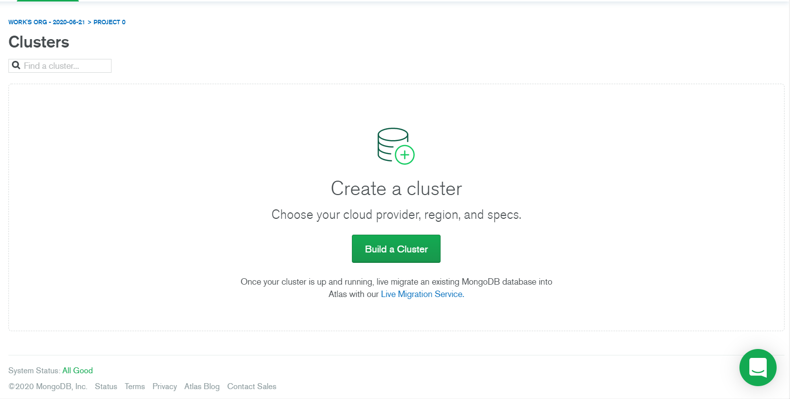
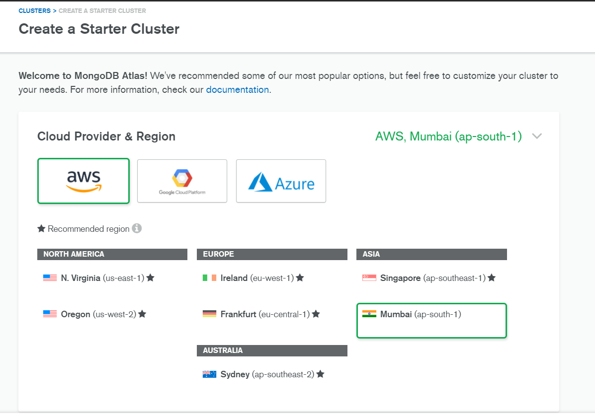
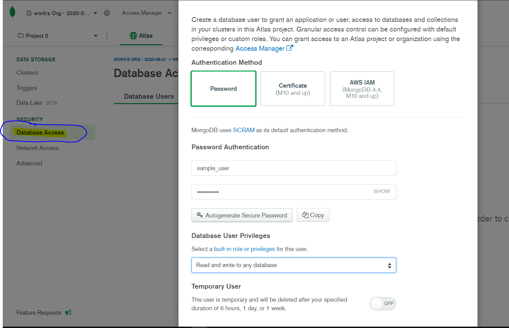
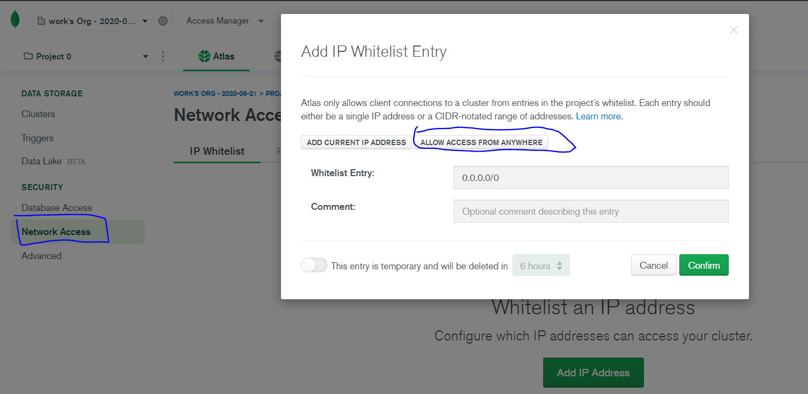
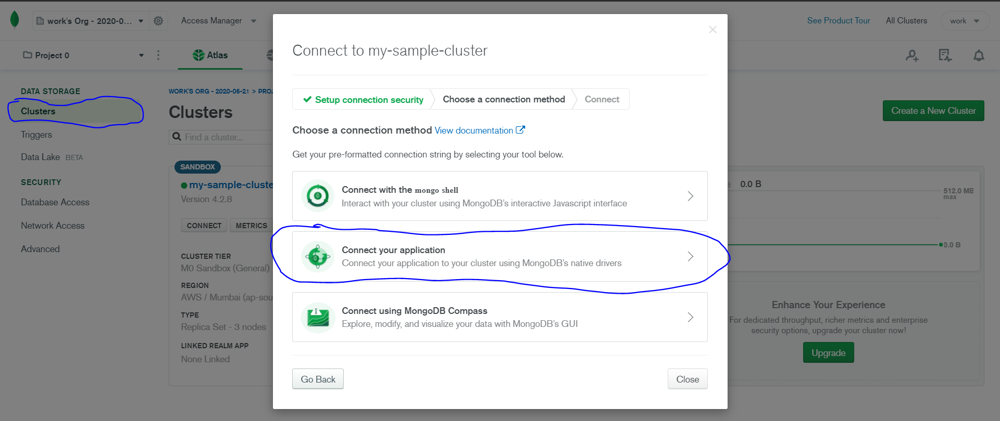
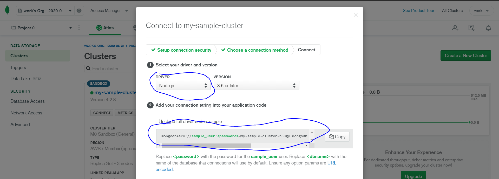

In this post, I will tell you how you can connect to [MongoDB Atlas](https://www.mongodb.com/cloud/atlas), a cloud based DB service, from your local Node.js / Express.js environment. 

You can use Atlas for any project which needs to be deployed, whether for development purpose or production environment.

Let's get started!

## Step 1: Register/Login and create your plan
Create your account at [Atlas](https://www.mongodb.com/cloud/atlas/register) and register yourself to their service. It's free of cost.
If you already have an account, go ahead. If you logging in for the first time, you will need to choose a plan for your account. There are 3 types to choose from, for testing and learning purpose,  "FREE PLAN" will suit your needs perfectly. After doing all basic registration and setup, it's time to create a Cluster.


## Step 2: Create your Cluster

After Registration/Login and choosing your plan, let's get our Cluster setup done. 

If you have no created clusters, you will see the below page on your dashboard.



*Create a Cluster*

Upon clicking "Build a cluster", you will be given with following options:



*Cluster Settings-1*

Here, on this page, you need to select Cloud Provider, and your Region. Upon selecting those, you can leave all other settings to their default and can go ahead. **If you want to change the name of your Cluster, you have to do it in this step only. Name cannot be changed once the cluster is created.**

Completing all the above steps, is what you need to create a Cluster. Now, MongoDB will configure and create your cluster and **this process will take about 5-10 minutes** (pretty long tbh). Come back to the same page once all is finished. 

We will now look at how to create and configure **database collections** and integrate it with our <code>express</code> server


## Step 3 : Add User and whitelist IP address

Till this step, we have successfully created our Cluster. Now, its time to add <u>Database User</u> and <u>IP address of your current machine</u>.

#### 1. Add database user

Go to Database access under SECURITY and click on "Add New Database User". Fill out the username and password, leaving all settings to default and **make sure you remember your credentials**. We will need it later on to create a connection string (URI) of our DB. 



*Create a user*

#### 2. Whitelist your IP address

Now, the next step is to Whitelist your IP address so it can recognize your machine for regular access. To whitelist your IP address, go to <u>SECURITY > Network Access</u> and click on "Add IP Address". Upon clicking that, you will be given with following page. Click on **Allow access from anywhere** which sets it to global access. Don't worry, its not any danger.



*Allowing access to Database*

Now, we've all setup done to use it to our Node.js server. It's time for some code.


## Step 4 : Connect to your database

In this step, we will connect our server to the database. To do this, go to main page of your cluster and click on "Connect" which will give you a modal like this:



Select "Connect your application". On clicking, you have to select "Node.js" in the next page and **save the connection string provided by Atlas somewhere for further use.**

 

Now, its time to create our database connection using <code>mongoose</code>. Install mongoose in your project by <code>npm install mongoose </code>.  Copy paste the following code to <code>db.js</code>.

```js
//db.js

const mongoose = require('mongoose')

const url = `mongodb+srv://sample_user:<password>@my-sample-cluster-b3ugy.mongodb.net/<dbname>?retryWrites=true&w=majority`;

const connectionParams={
    useNewUrlParser: true,
    useCreateIndex: true,
    useUnifiedTopology: true 
}
mongoose.connect(url,connectionParams)
    .then( () => {
        console.log('Connected to database ')
    })
    .catch( (err) => {
        console.error(`Error connecting to the database. \n${err}`);
    })
```

Replace  "password" with your user password and also the "dbname" with the name you'd like to have for your database. Run the following code by typing <code>node db.js</code> and you will see <u>Connected to database</u> in your console. You can take this to next step by configuring your DB model by creating a "Collection" with various fields and connecting it with the <code>express</code> server. I leave it up to you to use according to your need. This was the basic setup needed to get  Atlas up and running.


## Conclusion

Hooray, this way we have successfully connected to Atlas using Node.js. If you have any doubts, feel free contact me and I will try to resolve it on personal basis.

Thank you.


