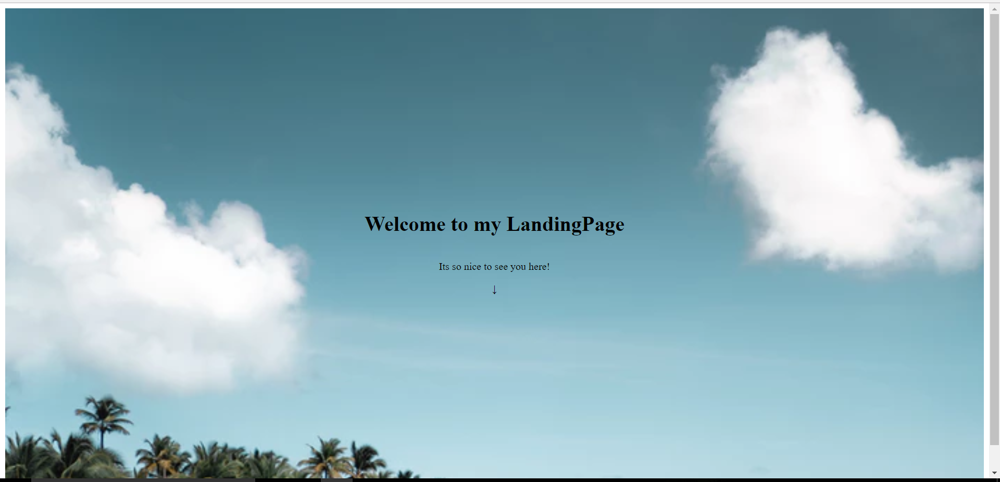

Hello geeks,

Today, in this “story” I’m going to demonstrate how to create a full screen responsive landing page for a website using pure HTML, CSS and bit jQuery

<br/>

## ***What is landing  page?***


It is a part of a website which serves as the entry point for your website. Your device’ full screen is taken by that page as soon as you load the website and afterwards you see the rest of the site.

<br/>

 

*Photo by [Lauren Mancke](https://unsplash.com/@laurenmancke?utm_source=unsplash&utm_medium=referral&utm_content=creditCopyText) on [Unsplash](https://unsplash.com/s/photos/landing-page?utm_source=unsplash&utm_medium=referral&utm_content=creditCopyText)*

###### 		

------

I’ll be dividing this tutorial in 3 parts:

#### **1.Setting up HTML**

#### **2.Adding CSS**

#### 3**.Little bit of jQuery(for click to scroll part)**

<br/>

### **Section 1:Setting up HTML**

<br/>

```html
<!DOCTYPE html>
<html>
<head>
	<title>FullScreenLandingPage</title>
	<meta charset="utf-8">
	<meta name="viewport" content="width=device-width, initial-scale=1.0">
	<link rel="stylesheet" type="text/css" href="index.css">
</head>
<body>

	<header>
		<h1>Welcome to my LandingPage</h1>
		<p>How are you doing?</p>
    	<span id="down">&#8595;</span>
	</header>

</body>
```


*Setting up basic HTML*

<br/>

The main idea behind creating this is to put the text-content which you want to see on landing page (e,g: See the sample photo above.There “Welcome to my LandingPage” and “It’s so nice to see you here” serves as the text) inside ```<header>``` tag which is inside ```<body> ```tag.

Here I’m also adding the down-arrow symbol (<span id="down">&#8595;</span>) on which if you click,will scroll you down to the rest of the web-page. I’m only focusing here for landing page. You may add rest of the content on your own.

If you save this much of code and open it in your browser it will look something like this(not what you wanted to see,right?)


<br/>

### **Section 2:Styling the page**


<br/>

```css
header
{
 height: 100vh;
 background-image: url(enter your photo url here!);
 /* flex-box thing */
 display: flex;
 flex-direction: column;
 align-items: center;
 justify-content: center;
 background-size: cover; 
 margin-bottom: 30px;
}
```

<br/>

In order for your background-image to take height of entire screen,you must add ***height:100vh;\*** rule*.* It’s telling the browser to take the entire 100% of available view-port height(vh = view-port height). Read about view-port [here](https://developer.mozilla.org/en-US/docs/Mozilla/Mobile/Viewport_meta_tag).

Now,in order for your text content to be in the middle of the background-image you’ll need to apply ***display:flex;\***


##### **flex-direction:column => this will take care to align text content inside ```<header>``` to be in vertical fashion.**

##### **align-items:center => this will center your text horizontally**

##### **justify-content:center => this will center your text vertically**

<br/>

If you don’t know what flex-box technology is,check that out [here](https://css-tricks.com/snippets/css/a-guide-to-flexbox/).

**background-size:cover =>** tells the browser to take entire height and width of the parent container for the image even if the image may get stretched in doing so.

<br/>

If you save till this,you’ll see something like this:




<br/>

You’ll notice a little white-space around the image.In order to fix that and to make your font look more intresting,add this:

```css
*
{
 margin: 0px;
 padding: 0px;
 font-family: monospace;
}
```

Now,let’s position our down-arrow near the bottom of the image.For that we must add this CSS rule for our down arrow which is a  ```<span>``` element with ID “arrow”.

```css
#down
{
 position: absolute;
 top:85vh;
 padding: 20px;
 font-size: 2.5em;
}
#down:hover
{
 cursor: pointer;
 background-color: #eee;
 opacity: 0.8;
}
```

We’re positioning that arrow “absolutely” 85% of view-port height from top of the page. Also,some :hover effect is added to make it look more good.

Here ends our CSS section

------

### **Section 3: jQuery(for click to scroll down part)**

<br/>

```js
<script type="text/javascript">
    
    //scroll to top on page refresh (PART1)
    window.onbeforeunload = function () {
      window.scrollTo(0, 0);
    }

    //for arrow click part (PART2)
    $(document).ready( function () {

     $('#down').on('click',function () {
      $("html").scrollTop(0);
       $('html, body').animate({
         scrollTop: $(where-you-want-to-scroll).offset().top
     }, 1000);
     });

    });

</script>
```

<br/>

I’ll suggest you to ignore this part of tutorial if you are new to JavasSript/jQuery.

What PART1 doing is,making sure when you refresh the page from any part of same page,you’ll see it always from top.

PART2 defines how you handle the ‘click’ event for that arrow and then scrolling the page till the section of your choice which you specify in **scrollTop** property.

Here,ends our jQuery part also.

------

This is all about what we wanted to create in this post.

Thank you for reading.I hope you liked it. :)

If you have any doubts/queries,feel free to ask in comments.

Here’s my code-pen link to the same code described above:

https://codepen.io/dalalRohit/pen/NzYMWP.

> CLAP IT IF YOU LIKE IT!.

Good bye ;)..