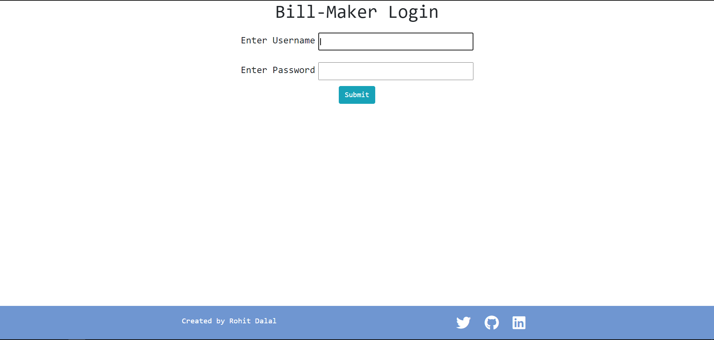

This project I made as my summer vacation timepass and it got pretty well from there.
Eliminated the problem of manually tracking invoices with other documents for my father' business.
This project made me learn so many things like JWT user-auth, DB integration and also learnt how to integrate all operations together. 

<button class="website">
    <a href="https://shreeji-bill-maker.herokuapp.com/" target="_blank" >Website</a>
</button>

#### Tech Stack
1. Node.js
2. Express.js
3. MongoDB
4. Bootstrap